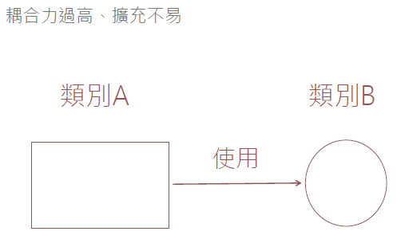
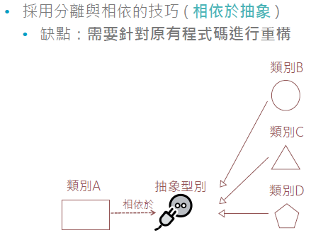

# 開放封閉原則OCP

## 開放封閉原則

+ 軟體實體 類別、模組、函式等 ) 應能**開放擴充**但**封閉修改**
+ 藉由**增加**新的程式碼來擴充系統的功能，而不是藉由**修改**原本已經存在的程式碼來擴充系統

## OCP的基本精神

+ 一個"類別"需要**開放**，意味著該類別可以被擴充
  + 可以透過**繼承**輕鬆做到
  + C#還有**擴充方法**可以輕鬆擴充既有類別
  
+ 一個"類別"需要**封閉**，意味著有其他人正在使用這個類別
  + 如果程式已經編譯，但又已經有人在使用原本的類別
  + 封閉修改可以有效避免未知的問題發生

## 常見的設計問題



## 關於OCP的實作方式



### OCP的C#範例

+ 透過 抽象類別 限制其修改，並透過繼承開放擴充不同實作

``` C#
public abstract class DataProvider {
  public abstract int OpenConnection();
  public abstract int CloseConnection();
  public abstract int ExecuteCommand();
}

```

--- 

## OCP 的使用時機

+ 你既有的類別已經被清楚定義，處於一個**強調穩定**的狀態
+ 你**需要擴充**現有的類別，**加入新需求**的屬性或方法
+ 你擔心修改現有程式碼會**破壞現有系統**的運作
+ 系統剛開始設計時就決定要採用 OCP 模式
  + 可以透過"介面"或"抽象"類別進行實作
