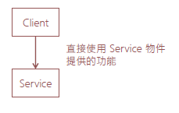
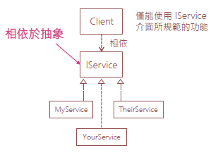

# 相依反轉原則DIP

+ 高階模組 不應該依賴於 低階模組 ，兩者都應**相依於抽象**
  + 高階模組 -> Caller (呼叫端)
  + 低階模組 -> Callee (被呼叫端)
+ **抽象**不應該相依於**細節**。而**細節**則應該**相依於抽象**

## DIP 的基本精神

+ 所有類別都要相依於抽象，而不是具體實作
  + 可透過 DI Container 達到目的
+ 為了要達到類別間鬆散耦合的目的
  + 開發過程中，所有**類別之間**的**耦合關係**一律透過**抽象介面**
  
## 常見的設計問題

+ 類別與類別之間緊密耦合，改 A 壞 B 的狀況層出不窮

``` C#

public class Client
{
  Service _Service;
  public void Client()
  {
    Service fooObj new Service();
  }
}
public class Service {}

```


## 什麼是相依反轉?

``` C#

public class Client
{
  IService _IService;
  public void Client( IService service)
  {
    _Service service;
  }
}

public interface IService {}
public class MyService : IService {}
public class YourService : IService {}
public class TheirService : IService {}

```



## DIP的實作方式

+ 型別全部都相依於抽象，而不是具體實作
+ 經過套用 DIP 之後，原來有相依於類別的程式碼
  + 都改成相依於**抽象型別**
  + 從**緊密耦合**關係變成**鬆散耦合**關係
  + 可以依據需求，隨時**抽換具體實作類別**
  
## DIP的使用時機

+ 想要降低耦合的時候
+ 希望類別都相依於抽象，讓團隊可以**更有效率**的開發系統
+ 想要可以替換具體實作，讓系統變得更有彈性
  + 符合**DIP**通常也意味著符合**OCP開放封閉**與**LSP里氏替換**原則
  + 只要再多考量**SRP單一責任**與**ISP介面隔離**就很棒了！


