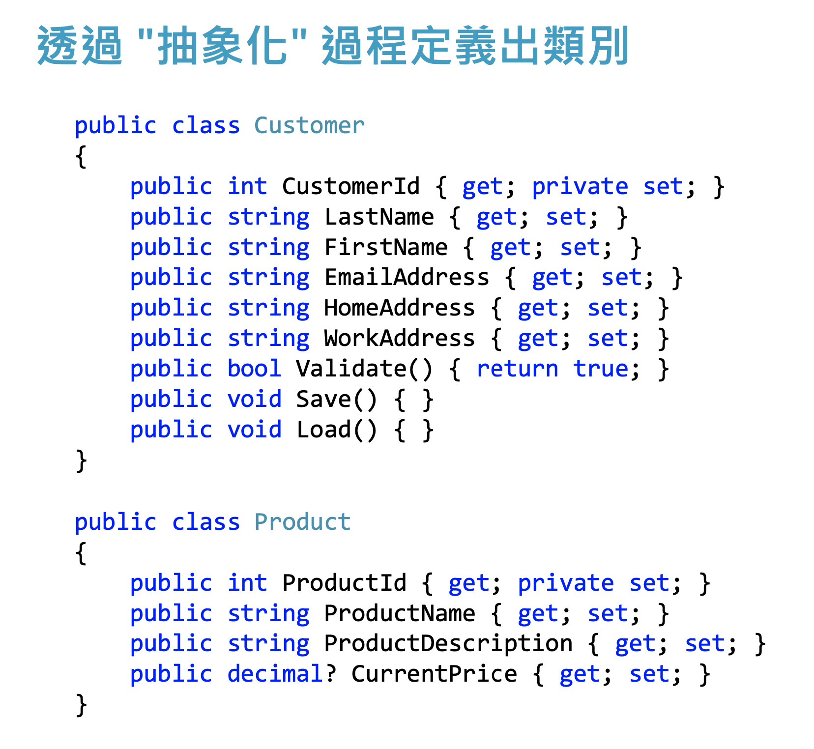
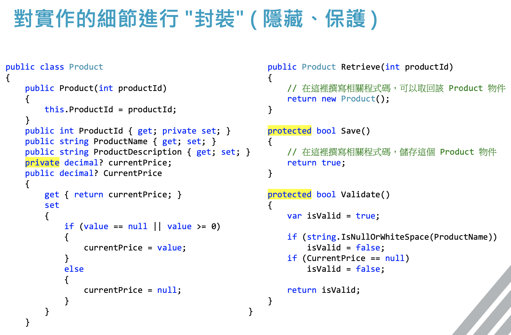
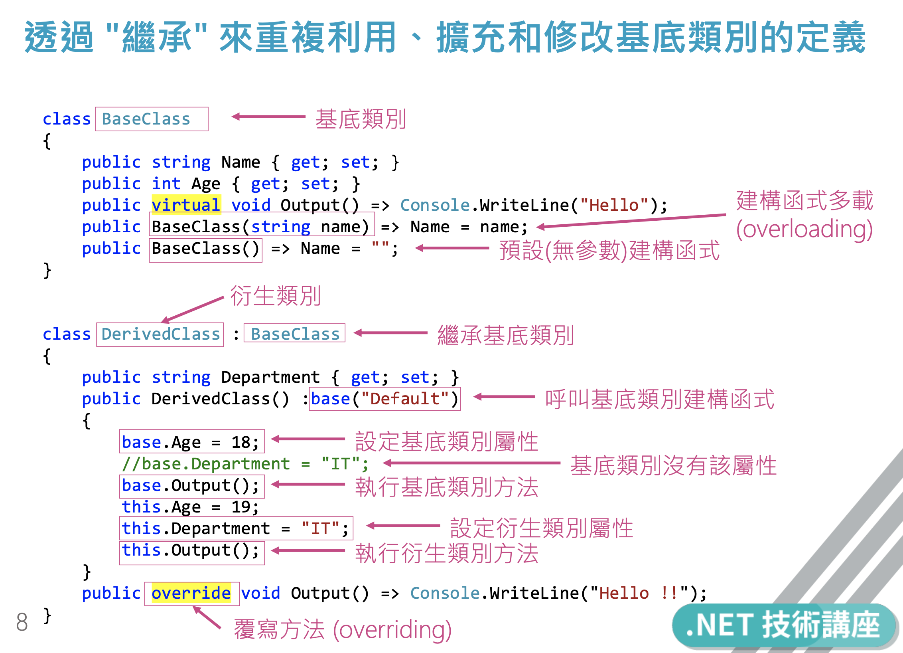

# OOP 物件導向設計的四個特性

## 抽象 ( Abstraction )

+ 將真實世界的需求轉換成為 OOP 中的類別 
+ 類別可以包含狀態(屬性)與行為(方法)。
    
 

## 封裝 ( Encapsulation )

+ 隱藏/保護內部實作的細節，並可以對屬性或方法設定存取層級 (public, private, protected)。

 

## 繼承 ( Inheritance )

+ 可讓您建立新類別以重複使用、擴充和修改其他類別中定義的行為。

 

## 多型 ( Polymorphism )

+ 在相同的介面下，可以用不同的型別來實現。 
+ 多型有分成好幾種不同類型。

#### 在設計時期 ( Design Time )
+ **基底類別**可以定義和實作「虛擬」屬性或方法 ( virtual )
+ **衍生類別**可以「覆寫」這些虛擬的屬性或方法 ( override )
#### 在執行時期 ( Runtime )
+ 當呼叫基底類別的虛擬方法時，會改呼叫子類別覆寫的方法

[常見的多型範例](https://docs.microsoft.com/zh-tw/dotnet/csharp/programming-guide/classes-and-structs/polymorphism)

---
## 內聚力與耦合力 (Cohesion & Coupling)

#### 何謂 "模組" (Module)

一種抽象的概念
+ 以C#舉例
  + 可能是一個「類別」( class )
  + 可能是一個「方法」( method )
  + 可能是一個「組件」( assembly )

### 內聚力 Cohesion

在一個 "模組" 內完成 "一件工作" 的度量指標

+ 高內聚力
  + 在一個 "模組" 內只完成一件工作
  + 內聚力高，意味著該模組可以獨立運作，也意味著更容易重複利用
  + 範例:一個 class 只負責一件事情 ( 例如寄送郵件 )
+ 低內聚力
  + 在一個 "模組" 內完成多份工作
  + 內聚力低，意味著這個模組會造成難以維護/測試/重用/理解
  + 範例:所有功能寫在一個 class 裡面或一個 method 有 5000 行程式碼
+ 最佳實務
  + 在設計模組的時候，要盡量設計出**高內聚力**的程式碼。
  + 若要在一個模組內完成多項工作，建議拆成多個不同的類別
  + 實現**SRP**就是實現「**提高內聚力**」的一種表現

### 耦合力 Coupling

模組與模組之間的關聯強度
  + 模組之間相互依賴的程度
  + 衡量兩個模組的緊密連接程度
  + 範例:在 ClassB 裡面，直接 "建立" 了 ClassA 的物件實體，就會建立 ClassA 與 ClassB 之間的 "耦合關係"。
+ 高耦合力
  + 意味著當改了 A 模組時，相關聯的 B 模組就會容易被影響 (改A壞B)
+ 低耦合力
  + 當在修改模組的時候，有越少的模組被影響，就意味著耦合力較低
+ 最佳實務
  + 在設計不同模組的時候，要盡量設計出**低耦合力**的程式碼。
  + 實現**DIP**就是實現「**降低耦合力**」的一個原則

---
理論應寫出**高內聚低耦合**的程式，但現實兩者互斥，故需要一些原則來幫助我們

## SOLID 物件導向設計原則

### 何謂原則(Principle)?

+ 所謂「原則」就是一種「概念」或「價值」，用來導引你產生適切的行為與價值評量方法 。
+ 白話文解釋
    + 依循 SOLID 原則，可以 寫出比較好的程式碼
    + 依循 SOLID 原則，能夠 判斷程式碼的好壞
 
### OOP物件導向程式設計的 SOLID 設計原則 

+ 單一責任原則 SRP
+ 開放封閉原則 OCP
+ 里氏替換原則 LSP
+ 介面隔離原則 ISP
+ 相依反轉原則 DIP

### 學習SOLID 物件導向設計原則的好處

+ 降低程式碼複雜程度
+ 具有較佳程式碼可讀性
+ 提升模組可重複利用性
+ 讓模組具有高內聚力、低耦合力
+ 面臨變更需求時可減少破壞現有模組的風險
